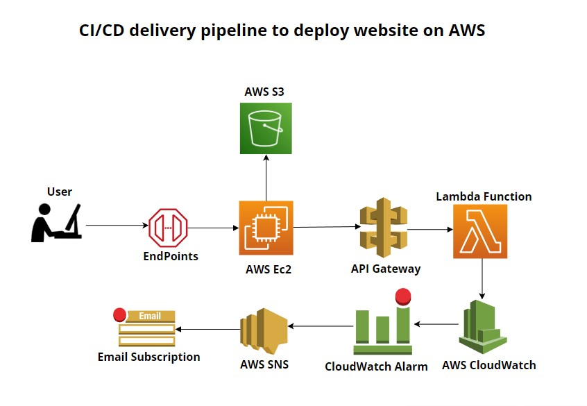
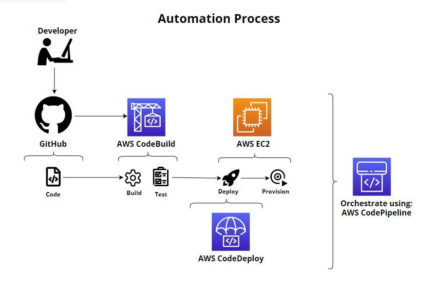

## Architection Design Description:

Design of an end-to-end CI/CD delivery pipeline for a website on AWS that has following components:
<ol>
<li>EC2 instances for some static calculations</li>
<li>S3 for website pages </li>
<li>API GW and lambda triggers</li>
<li>CloudWatch alarms on number of API calls received</li>
</ol>

##  Architecture Diagram:

### CI/CD delivery pipeline for a website on AWSArchitecture Diagram

   

    
   

 

### Automation Architecture Diagram

   

     
  

 

To create an end-to-end CI/CD delivery pipeline for a website on AWS, you can follow these steps:

<ol align="justify">   
<li>Set up an Amazon S3 bucket to store the website pages. The bucket should be configured to host a static website. </li>

<li>Set up an Amazon EC2 instance to run the static calculations required by the website. The EC2 instance should be configured to run the necessary software and libraries for the calculations.</li>

<li>Set up an Amazon API Gateway to handle requests to the website and trigger corresponding Lambda functions to handle the 
requests.</li>

<li>Set up Lambda functions to handle the requests from the API Gateway and perform the necessary actions. For example, a Lambda function can be triggered when an API request is received to retrieve data from the EC2 instance and return it to the website.</li>

<li>Set up an Amazon CloudWatch alarm to monitor the number of API calls received by the API Gateway. The alarm can be configured to send a notification when the number of API calls exceeds a certain threshold.</li>

<li>To enable continuous delivery, you can set up a continuous integration (CI) tool such as Jenkins or AWS CodePipeline. The CI tool can be configured to automatically build, test, and deploy the website to the S3 bucket whenever code changes are made to the website's source code. </li>

<li>To enable continuous deployment, you can set up a deployment pipeline in the CI tool. The deployment pipeline can be configured to automatically deploy the website to the S3 bucket and update the API Gateway and Lambda functions when new code is pushed to the repository.</li>

</ol>

By following these steps, you can create an end-to-end CI/CD delivery pipeline for a website on AWS that uses EC2 instances for static calculations, S3 for website pages, API Gateway and Lambda triggers, and CloudWatch alarms to monitor the number of API calls received.

