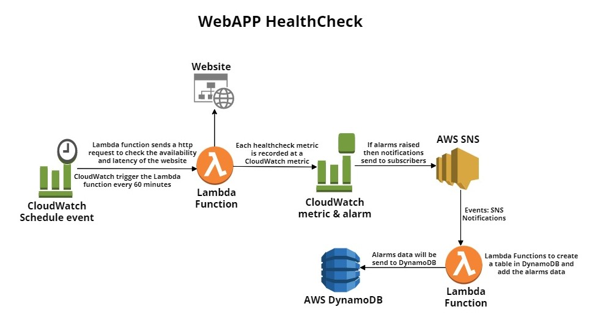

## Architection Design Description:

Design a HealthCheck Application for a Website, application should contains the following components:
<ol>
<li>Run the corn job to check the health of the website</li>
<li>Check the availability of the website</li>
<li>Check the health of the website</li>
<li>If alarms raised then notify the developers</li>
<li>Store the raise alarms in the database for further observations</li>
</ol>

##  Architecture Diagram:

### WebApp HealthCheck Architecture Diagram

   

    
   

 

To create an application that can monitor the health of the website, you can follow these steps:

<ol align="justify">   
<li>Create a Lambda function that will check the availabilty and latency of the website.</li>
<li>CloudWatch to obtain the metrics from the website. Alarms are set on the metrics, with thresholds for latency and availability, so that if the thresholds are exceeded, the alarms will trigger.</li>
<li>If the alarms are triggered, they will send a message to an SNS topic. The SNS topic is configured to send an email to the developer.</li>
<li>The Lambda function will be converted into a cron job that runs every 60 minutes, so the website metrics are checked on a regular basis.</li>
<li>Another Lambda function will be created to create a table in DynamoDb and write the alarms to it for analytics purposes.</li>
<li>Use the data in DynamoDb table for analytics work, like identifying patterns, trends, and making decisions based on the data.</li>
</ol>

By following these steps, you will be able to monitor the health of the website and be notified if there are any issues.

